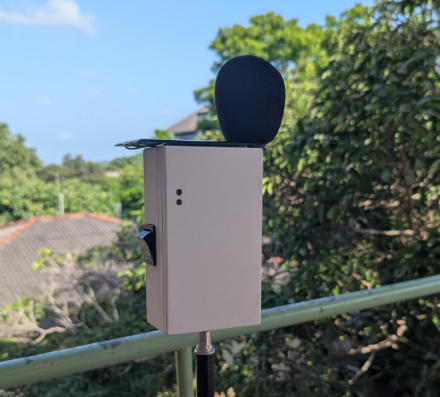

---

# SPARK — Continuous Noise Level Monitoring (Raspberry Pi)

A low-cost, cloud-connected device that continuously measures environmental noise at sites like construction zones, wind farms, factories, and neighborhoods — built around a **Raspberry Pi**. Data is processed on-device (A-weighting, Leq, percentiles) and uploaded for dashboards, alerts, and compliance checks.

<div align="center">
 


</div>


---

## ✨ Features

* **Continuous metrics:** `LAeq(1s)`, `LAeq(1min)`, `Lmax`, `Lmin`, `L10/L50/L90`, rolling stats
* **On-device processing:** A/C/Z weighting, band-limiting, anti-aliasing, buffering for offline sync
* **Cloud upload:** Pluggable backends (MQTT/HTTP). Example configs included
* **Resilient by design:** Local store & replay when the network is down
* **Site metadata:** Site ID, coordinates, mic gain, temperature/humidity (🔧 optional sensor)
* **Pilot ready:** Works outdoors with a suitable mic + windscreen and enclosure
* **Open & hackable:** Python and C++ code; easy to extend

---

## 🗂 Repository layout

```
.
├─ RPI_reciver/            # Raspberry Pi receiver/processor (Python)
├─ Spark_V1.cpp            # Edge firmware/source (e.g., ESP32/MCU capture) (C++)
└─ README.md               # You are here
```
---

## 🧰 Hardware (reference build)

* **Compute:** Raspberry Pi 4/5 (or Pi Zero 2 W for low power)

  * I²S MEMS mic (e.g., ICS-43434 / SPH0645) with windscreen & outdoor housing
  * Analog measurement mic + USB audio interface / external ADC 
* **Power:** 5V supply (UPS HAT recommended for outdoor)
* **Optional sensors:** Temp/Humidity/Baro for metadata
* **Enclosure:** Weather-resistant IP-rated box + acoustic windshield for outdoor use

---

## 🖥️ Software & prerequisites

* Raspberry Pi OS (64-bit recommended), Python 3.10+
* Enable I²S (if using I²S mic) via `raspi-config` → Interfacing → I²S
* Packages: `python3-venv`, `git`, `build-essential`

---

## 🚀 Quick start (Raspberry Pi)

```bash
# 1) Clone
git clone https://github.com/Ravindu-Kuruppuarachchi/Noise-Level-Measuring.git
cd Noise-Level-Measuring/RPI_reciver

# 2) Python env
python3 -m venv .venv
source .venv/bin/activate

# 3) Install deps
pip install --upgrade pip
pip install -r requirements.txt   

# 4) Configure
cp .env.example .env              
# edit .env (see below)

# 5) Run
python main.py                    
```

### `.env` example

```ini
# Device
SITE_ID=windfarm-west-01
LOCATION_LAT=00.0000
LOCATION_LON=00.0000
MIC_CHANNEL=0
SAMPLE_RATE=48000
WEIGHTING=A        # A|C|Z
LEQ_WINDOW_S=1     # 1-second LAeq
GAIN_DB=0

# Cloud (choose one path)
UPLOAD_MODE=MQTT   # MQTT|HTTP|OFF
MQTT_BROKER=mqtts://broker.example.com
MQTT_USERNAME=🔧
MQTT_PASSWORD=🔧
MQTT_TOPIC=sites/windfarm-west-01/noise

HTTP_ENDPOINT=https://api.example.com/ingest
HTTP_API_KEY=🔧

# Storage (local buffering)
LOCAL_DB=./data/noise.sqlite
FLUSH_INTERVAL_S=15
```

---

## 📡 Data model

**Sample payload (MQTT/HTTP):**

```json
{
  "siteId": "windfarm-west-01",
  "ts": "2025-08-15T13:30:22Z",
  "metrics": {
    "laeq_1s": 57.3,
    "laeq_1min": 55.9,
    "lmax": 64.2,
    "lmin": 43.1,
    "l10": 60.8,
    "l50": 55.4,
    "l90": 47.6
  },
  "meta": {
    "fs": 48000,
    "weighting": "A",
    "gain_db": 0,
    "lat": 0.0,
    "lon": 0.0,
    "temp_c": 30.1,
    "rh_pct": 74.0
  }
}
```

---

## 🎛️ Calibration workflow (strongly recommended)

1. **Mic & path setup:** Assemble the exact mic, windscreen, and input chain you will deploy.
2. **Reference source:** Use a **sound calibrator** (e.g., 94 dB @ 1 kH)
3. **Verify on site:** Re-run a quick check after installation.

---

## 🔌 MCU / edge capture (C++)

`Spark_V1.cpp` demonstrates low-level audio capture/streaming on an MCU (e.g., ESP32). Typical duties:

* Sample PCM (I²S/ADC), apply basic filtering, timestamp frames
* Stream chunks to the Raspberry Pi over serial/Wi-Fi (UDP/TCP/MQTT)
* Fallback ring-buffer when the link drops

---

## 🧩 Roadmap

* [ ] Class-2-ish mic chain & enclosure notes
* [ ] Multi-mic “noise compass” (direction finding)
* [ ] Edge FFT/octave-band levels (1/3-octave)
* [ ] OTA updates & remote config
* [ ] Built-in web UI for live view

---

## 📚 Acknowledgments

* A-weighting, Leq and percentile methods follow standard acoustics practice; verify against your regulatory standards where required.
* Thanks to everyone contributing to low-cost environmental monitoring.


